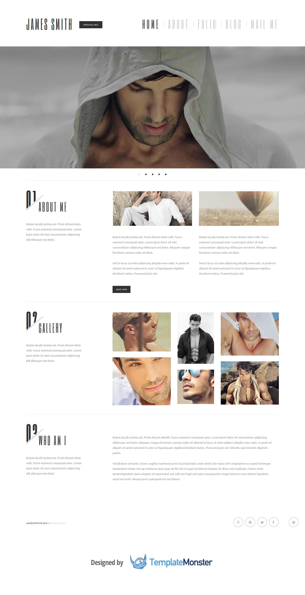

Робота півфіналу UaWebChallenge
======
На верстку макета відводилось 6 годин, + адаптивність і кроссбраузерність, було круто)
###### Технології: Html5, Css3, JS, jQuery, Scss, reset.css, microformats.
###### Тести: IE8+, Firefox29.0, Chrome34.0, Opera21.0, Safari5.1, Yandex.bro14.2

UPD:
------
Робота не в оригінальному вигляді, так як в деяких місцях рефакторив код, пробуючи нові штуки, проте історія все пам'ятає)

Пара моментів:
---
- В reset.css більшості елементів властивість `box-sizing` має значення `border-box`.
- Розмітка валідна, а от з цсс є нюанси в плані валідності деяких цсс3 штук

**Репозиторій на гітхаб** [https://github.com/orlovmax/uawebchallenge_semifinal](https://github.com/orlovmax/uawebchallenge_semifinal)

Демо
------
Жива демка: [http://orlovmax.github.io/uawebchallenge-semifinal](http://orlovmax.github.io/uawebchallenge_semifinal "Глянути резалт півфіналу UaWebChallenge")

Тестові скріншоти
------
**Скріни лежать в каталозі [test_screenshots](https://github.com/orlovmax/uawebchallenge_semifinal/tree/master/test_screenshots/)**

- Тест сумісності браузерів, окрім експлореру, з нього скріни не отримав, але там все норм. [browser_compat](https://github.com/orlovmax/uawebchallenge_semifinal/tree/master/test_screenshots/browser_compat/)
- Тест адаптивності [responsive](https://github.com/orlovmax/uawebchallenge_semifinal/tree/master/test_screenshots/responsive/)

---

